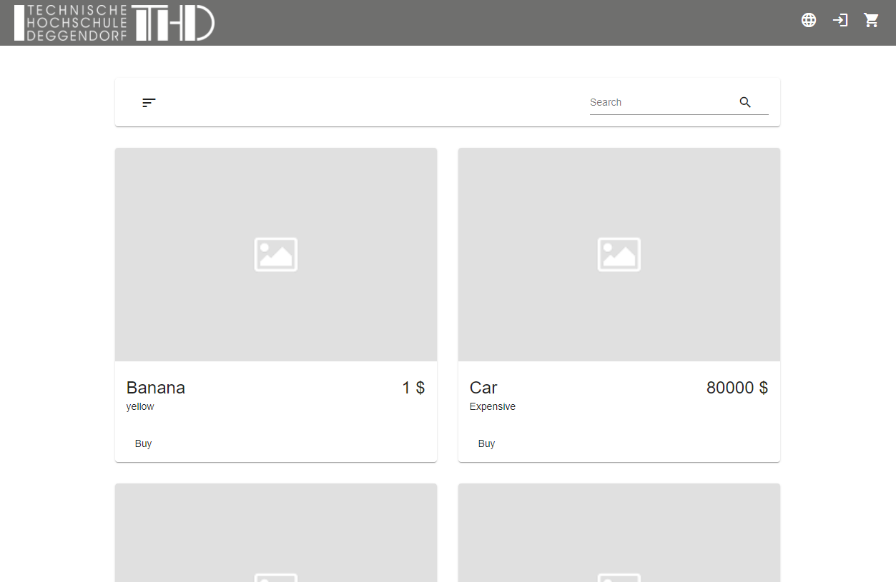
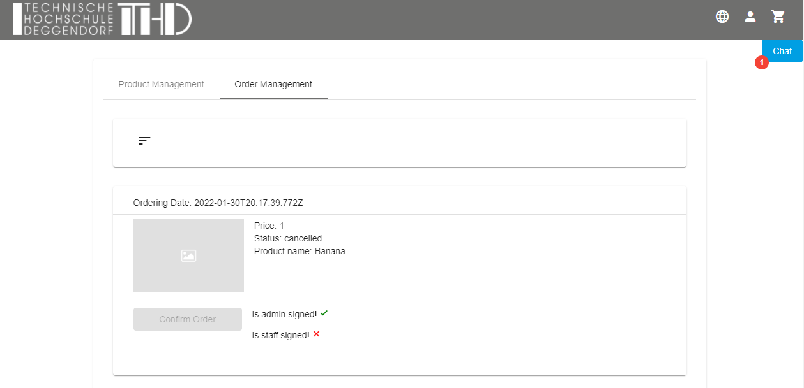

## Prerequisites
Before running the application, MongoDB database server needs to be running. The database is called '[mongodb://127.0.0.1:27017:procurment-app](mongodb://127.0.0.1:27017/procurment-app)'.

## Project setup Procurement-App (Frontend)
```
npm install
```

### Compiles and hot-reloads for development Procurement-App
```
ng serve
```

### Compile and start Procurement-App Frontend & Procurement-App-Backend Documentation
```
npm run compodoc
```

## Project setup Procurement-App-Backend (Backend)
```
npm install
```
 
### Compiles and hot-reloads for development Procurement-App-Backend
```
npm run dev
```

### Compiles and starts Procurement-App-Backend
```
npm run start
```

### Compile and start Procurement-App-Backend Documentation
```
npm run compodoc
```

## Instruction Manual Procurement-App

### Startup

When the angular application is running you can access the landing page with URL http://localhost:4200/.
At all times the user can go back to this page by clicking the 'THD' symbol in the navigation-bar.



From this site every user can order items, by adding them to the shopping cart, this can be done before the user is logged in.
If the user is satisfied with the selected item collection and wants to checkout, he or she has to press the cart symbol
in the top right-hand corner to access the shopping-cart.


If the user is not logged in by now he or she gets redirected to the login/registration page.

### Login and Registration

The login/registration page provides two tabs, one for login and one for registration. The registration provides several fields
to mimik real-world e-commerce applications, but only fieds with the '*' symbol are required. These includes:
- Name
- Role
- E-Mail
- Password


After successful login or registration the user gets redirected to the landing page.

### Item/Product Ordering
From here a 'Customer' can finish the initial purchase or access his orderings under the 'My-Products' option,
which can be found in the profile menu, next to the shopping-cart in the navigation. If you navigate
to the 'My-Products' page, the user can see the 'Ordered Products' tab, with a list of all his orderings.
Depending on the status of the order, the user can take several actions. 
- If the order is not already 'shipped' or 'cancelled', the user can cancel the order.
- If the order is 'invoiced', 'admin signed' and 'staff signed', then he or she can finish the order process.
and aquire the item. After this process it's labeled 'shipped'. (As this is just a simulation of an transaction
and no real item can be aquired, the 'ininventory' state has been removed, as the 'shipped' status marks already the end of the transaction, 
the new 'cancelled' state has been added in return!)
- Filter orders with the filter menu.


### Item/Product and Order Managment
Logged in as 'Staff' or 'Admin' the user can access the 'My-Products' page in a similar manner. In contrast to the 'Customer'
the 'Staff' role has the 'Product Management' and 'Order Management' tab. In the 'Product Management' tab we have following
options:
- Create a new item/product with the plus '+' icon.
- Edit an item/product with pencil icon on the items itself.
- Delete a specific item with the garbage can icon, next to it.
- Filter the items/products with the filter menu.


With the user role 'Staff', we can only edit and delete self created items, in contrast to the 'Admin' user, which can access
all items. But since it is not the task of the 'Admin' to create new items, this action remains unuseable for this role.
  
In the 'Order Management' we can confirm/sign orders, which only relate to products, we created as a 'Staff' member. The 'Admin'
instead confirms/signs only orders over the value of 50000€. All cheaper orderings are automatically signed by an admin.



### Profile Management

In the user profile we can see all user relevant properties and are able to update all these properties with the exception of
the user role.


### Chat

If the user is logged in as 'Staff', he or she can see a small banner with 'Chat' written on it, 
at the top right-hand corner under the navigation. By clicking on it, a chat box will move in front of the page,
providing basic chat functionality. On the 'Chat' banner is also a badge showing the current 'Staff' members online.


### Internalization

The appliccation language can be switched between german and english with the globe symbole in the navigation bar.

### Static Content

The footer contains links to two static pages, one for the legal notice and one for data privacy.
Both pages hold their respective content.

## File Structure 

Following visualizes front- and backend file structure of the procurement app.

### Procurement-App (Frontend)

src\
 ┣ app\
 ┃ ┣ auth\
 ┃ ┃ ┣ auth-interceptor.service.spec.ts\
 ┃ ┃ ┣ auth-interceptor.service.ts\
 ┃ ┃ ┣ auth.guard.spec.ts\
 ┃ ┃ ┣ auth.guard.ts\
 ┃ ┃ ┣ auth.service.spec.ts\
 ┃ ┃ ┗ auth.service.ts\
 ┃ ┣ chat\
 ┃ ┃ ┣ chat.service.spec.ts\
 ┃ ┃ ┗ chat.service.ts\
 ┃ ┣ components\
 ┃ ┃ ┣ content\
 ┃ ┃ ┃ ┣ data-privacy\
 ┃ ┃ ┃ ┃ ┣ data-privacy.component.html\
 ┃ ┃ ┃ ┃ ┣ data-privacy.component.scss\
 ┃ ┃ ┃ ┃ ┣ data-privacy.component.spec.ts\
 ┃ ┃ ┃ ┃ ┗ data-privacy.component.ts\
 ┃ ┃ ┃ ┣ home\
 ┃ ┃ ┃ ┃ ┣ home.component.html\
 ┃ ┃ ┃ ┃ ┣ home.component.scss\
 ┃ ┃ ┃ ┃ ┣ home.component.spec.ts\
 ┃ ┃ ┃ ┃ ┗ home.component.ts\
 ┃ ┃ ┃ ┣ legal-notice\
 ┃ ┃ ┃ ┃ ┣ legal-notice.component.html\
 ┃ ┃ ┃ ┃ ┣ legal-notice.component.scss\
 ┃ ┃ ┃ ┃ ┣ legal-notice.component.spec.ts\
 ┃ ┃ ┃ ┃ ┗ legal-notice.component.ts\
 ┃ ┃ ┃ ┣ login\
 ┃ ┃ ┃ ┃ ┣ login.component.html\
 ┃ ┃ ┃ ┃ ┣ login.component.scss\
 ┃ ┃ ┃ ┃ ┣ login.component.spec.ts\
 ┃ ┃ ┃ ┃ ┗ login.component.ts\
 ┃ ┃ ┃ ┣ page-not-found\
 ┃ ┃ ┃ ┃ ┣ page-not-found.component.html\
 ┃ ┃ ┃ ┃ ┣ page-not-found.component.scss\
 ┃ ┃ ┃ ┃ ┣ page-not-found.component.spec.ts\
 ┃ ┃ ┃ ┃ ┗ page-not-found.component.ts\
 ┃ ┃ ┃ ┣ profile\
 ┃ ┃ ┃ ┃ ┣ profile.component.html\
 ┃ ┃ ┃ ┃ ┣ profile.component.scss\
 ┃ ┃ ┃ ┃ ┣ profile.component.spec.ts\
 ┃ ┃ ┃ ┃ ┗ profile.component.ts\
 ┃ ┃ ┃ ┣ profile-product-overview\
 ┃ ┃ ┃ ┃ ┣ product-confirmation-dialog\
 ┃ ┃ ┃ ┃ ┃ ┣ product-confirmation-dialog.component.html\
 ┃ ┃ ┃ ┃ ┃ ┣ product-confirmation-dialog.component.scss\
 ┃ ┃ ┃ ┃ ┃ ┣ product-confirmation-dialog.component.spec.ts\
 ┃ ┃ ┃ ┃ ┃ ┗ product-confirmation-dialog.component.ts\
 ┃ ┃ ┃ ┃ ┣ profile-product-dialog\
 ┃ ┃ ┃ ┃ ┃ ┗ profile-product-dialog\
 ┃ ┃ ┃ ┃ ┃ ┃ ┣ profile-product-dialog.component.html\
 ┃ ┃ ┃ ┃ ┃ ┃ ┣ profile-product-dialog.component.scss\
 ┃ ┃ ┃ ┃ ┃ ┃ ┣ profile-product-dialog.component.spec.ts\
 ┃ ┃ ┃ ┃ ┃ ┃ ┗ profile-product-dialog.component.ts\
 ┃ ┃ ┃ ┃ ┣ profile-product-overview.component.html\
 ┃ ┃ ┃ ┃ ┣ profile-product-overview.component.scss\
 ┃ ┃ ┃ ┃ ┣ profile-product-overview.component.spec.ts\
 ┃ ┃ ┃ ┃ ┗ profile-product-overview.component.ts\
 ┃ ┃ ┃ ┗ shopping-cart\
 ┃ ┃ ┃ ┃ ┣ shopping-cart.component.html\
 ┃ ┃ ┃ ┃ ┣ shopping-cart.component.scss\
 ┃ ┃ ┃ ┃ ┣ shopping-cart.component.spec.ts\
 ┃ ┃ ┃ ┃ ┗ shopping-cart.component.ts\
 ┃ ┃ ┣ footer\
 ┃ ┃ ┃ ┣ footer.component.html\
 ┃ ┃ ┃ ┣ footer.component.scss\
 ┃ ┃ ┃ ┣ footer.component.spec.ts\
 ┃ ┃ ┃ ┗ footer.component.ts\
 ┃ ┃ ┗ header\
 ┃ ┃ ┃ ┣ chat\
 ┃ ┃ ┃ ┃ ┣ chat.component.html\
 ┃ ┃ ┃ ┃ ┣ chat.component.scss\
 ┃ ┃ ┃ ┃ ┣ chat.component.spec.ts\
 ┃ ┃ ┃ ┃ ┗ chat.component.ts\
 ┃ ┃ ┃ ┣ navigation\
 ┃ ┃ ┃ ┃ ┣ navigation.component.html\
 ┃ ┃ ┃ ┃ ┣ navigation.component.scss\
 ┃ ┃ ┃ ┃ ┣ navigation.component.spec.ts\
 ┃ ┃ ┃ ┃ ┗ navigation.component.ts\
 ┃ ┃ ┃ ┣ header.component.html\
 ┃ ┃ ┃ ┣ header.component.scss\
 ┃ ┃ ┃ ┣ header.component.spec.ts\
 ┃ ┃ ┃ ┗ header.component.ts\
 ┃ ┣ material\
 ┃ ┃ ┗ material.module.ts\
 ┃ ┣ order\
 ┃ ┃ ┣ order.service.spec.ts\
 ┃ ┃ ┗ order.service.ts\
 ┃ ┣ product\
 ┃ ┃ ┣ product.service.spec.ts\
 ┃ ┃ ┗ product.service.ts\
 ┃ ┣ shopping-cart\
 ┃ ┃ ┣ shopping-cart.service.spec.ts\
 ┃ ┃ ┗ shopping-cart.service.ts\
 ┃ ┣ user\
 ┃ ┃ ┣ user.service.spec.ts\
 ┃ ┃ ┗ user.service.ts\
 ┃ ┣ app-routing.module.ts\
 ┃ ┣ app.component.html\
 ┃ ┣ app.component.scss\
 ┃ ┣ app.component.spec.ts\
 ┃ ┣ app.component.ts\
 ┃ ┗ app.module.ts\
 ┣ assets\
 ┃ ┣ i18n\
 ┃ ┃ ┣ de.json\
 ┃ ┃ ┗ en.json\
 ┃ ┣ .gitkeep\
 ┃ ┣ THD-Logo.png\
 ┃ ┗ theme.scss\
 ┣ environments\
 ┃ ┣ environment.prod.ts\
 ┃ ┗ environment.ts\
 ┣ favicon.ico\
 ┣ index.html\
 ┣ main.ts\
 ┣ polyfills.ts\
 ┣ styles.scss\
 ┗ test.ts

### Procurement-App-Backend (Backend)

src\
┣ chat\
┃ ┣ chatMessage.ts\
┃ ┗ constant.ts\
┣ controllers\
┃ ┣ orderController.ts\
┃ ┣ productController.ts\
┃ ┗ userController.ts\
┣ db\
┃ ┗ mongoose.ts\
┣ middleware\
┃ ┗ auth.ts\
┣ models\
┃ ┣ orderModel.ts\
┃ ┣ productModel.ts\
┃ ┗ userModel.ts\
┣ routes\
┃ ┣ orderRouter.ts\
┃ ┣ productRouter.ts\
┃ ┗ userRouter.ts\
┣ config.ts\
┗ server.ts

